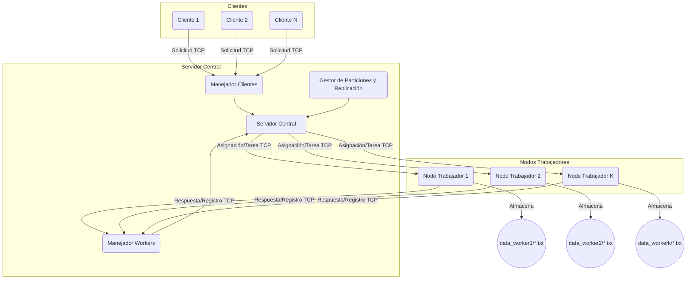

# Informe Detallado del Proyecto: Sistema Bancario Distribuido

## 1. Introducción

### 1.1. Propósito del Proyecto
El presente proyecto tiene como objetivo desarrollar un sistema bancario distribuido simulado. Este sistema permite realizar operaciones bancarias básicas como consultas de saldo y transferencias de fondos entre cuentas. La implementación se enfoca en los principios de la computación distribuida, utilizando Java como lenguaje de programación principal, junto con sockets para la comunicación de red, serialización de objetos para el intercambio de datos y concurrencia nativa de Java para el manejo de múltiples solicitudes. Se ha evitado el uso de frameworks avanzados o protocolos de comunicación de alto nivel (como RMI, gRPC, o colas de mensajes) para centrarse en los fundamentos de la construcción de sistemas distribuidos. La persistencia de datos se simula mediante el uso de archivos de texto (`.txt`).

### 1.2. Tecnologías Clave
*   **Lenguaje de Programación:** Java (JDK 11 o superior).
*   **Comunicación en Red:** Sockets TCP/IP.
*   **Serialización de Datos:** Java Object Serialization (`java.io.Serializable`).
*   **Concurrencia:** Java Native Concurrency (`java.util.concurrent.ExecutorService`, `synchronized` blocks/methods).
*   **Persistencia de Datos (Simulada):** Archivos de texto plano (`.txt`), con datos iniciales cargados desde archivos CSV.
*   **Principios de Diseño:** KISS (Keep It Simple, Stupid), DRY (Don't Repeat Yourself), SRP (Single Responsibility Principle).

## 2. Arquitectura del Sistema

El sistema sigue una arquitectura distribuida de tres capas principales:

*   **Clientes (`client`):** Entidades que inician las operaciones bancarias. Se comunican exclusivamente con el Servidor Central.
*   **Servidor Central (`central-server`):** Actúa como coordinador y punto de entrada para los clientes. No almacena datos de cuentas directamente (excepto metadatos de particionamiento y workers). Se encarga de:
    *   Autenticar y gestionar conexiones de clientes.
    *   Recibir solicitudes de los clientes.
    *   Determinar qué Nodo(s) Trabajador(es) son responsables de los datos involucrados en una operación.
    *   Delegar las operaciones a los Nodos Trabajadores correspondientes.
    *   Coordinar transacciones que involucran múltiples Nodos Trabajadores (ej., transferencias entre diferentes particiones).
    *   Gestionar el registro, estado y asignación de particiones a los Nodos Trabajadores.
    *   Manejar la replicación de datos instruyendo a los Nodos Trabajadores.
*   **Nodos Trabajadores (`worker-node`):** Responsables de almacenar y procesar un subconjunto (partición) de los datos del sistema (clientes, cuentas). Cada partición de datos se replica en múltiples Nodos Trabajadores (configurado para tres réplicas) para asegurar la disponibilidad y tolerancia a fallos. Los Nodos Trabajadores:
    *   Se registran con el Servidor Central al iniciar.
    *   Reciben del Servidor Central las particiones de datos que deben gestionar y los datos iniciales para esas particiones.
    *   Crean y mantienen archivos `.txt` locales para almacenar los datos de sus particiones asignadas.
    *   Ejecutan las operaciones sobre los datos (leer saldo, actualizar saldo) según las instrucciones del Servidor Central.
    *   Se comunican únicamente con el Servidor Central.



## 3. Modelo de Datos (`commons`)

Las siguientes clases representan las entidades principales del sistema. Todas implementan `java.io.Serializable` para permitir su transmisión a través de sockets.

*   **`Cliente.java`:**
    *   `idCliente` (String): Identificador único del cliente.
    *   `nombre` (String): Nombre del cliente.
    *   `email` (String): Correo electrónico del cliente.
    *   `telefono` (String): Número de teléfono del cliente.

*   **`Cuenta.java`:**
    *   `idCuenta` (String): Identificador único de la cuenta.
    *   `idCliente` (String): Identificador del cliente propietario de la cuenta.
    *   `saldo` (double): Saldo actual de la cuenta.
    *   `tipoCuenta` (String): Tipo de cuenta (ej., "AHORRO", "CORRIENTE").


## 4. Comunicación (`commons`)

La comunicación entre los diferentes componentes del sistema se realiza mediante el intercambio de objetos serializados.

*   **`Solicitud.java`:** Utilizada por el Cliente para enviar peticiones al Servidor Central, y por el Servidor Central para enviar tareas a los Nodos Trabajadores.
    *   `tipoOperacion` (TipoOperacion): Indica la operación a realizar.
    *   `parametros` (Map<String, Object>): Contiene los datos necesarios para la operación (ej., `ID_CUENTA`, `MONTO`, `ID_CUENTA_ORIGEN`, `ID_CUENTA_DESTINO`, `ID_PARTICION`).

*   **`Respuesta.java`:** Utilizada por el Servidor Central para responder al Cliente, y por los Nodos Trabajadores para responder al Servidor Central.
    *   `estadoOperacion` (EstadoOperacion): Indica el resultado de la operación.
    *   `mensaje` (String): Mensaje descriptivo sobre el resultado.
    *   `datos` (Object): Datos adicionales retornados por la operación (ej., saldo consultado, objeto `Transaccion` generado).

*   **`MensajeWorker.java`:** Utilizado específicamente para la comunicación administrativa entre el Servidor Central y los Nodos Trabajadores durante el registro y la asignación de datos/particiones.
    *   `tipoMensaje` (enum `Tipo`): Define el propósito del mensaje (REGISTRO, ASIGNACION_PARTICIONES, DATOS_PARTICION, CONFIRMACION_RECEPCION_DATOS, LISTO_PARA_OPERAR, ERROR_REGISTRO).
    *   `workerId` (String): ID del worker.
    *   `puertoEscuchaTareas` (int): Puerto donde el worker escuchará tareas del servidor.
    *   `particionesAsignadas` (List<String>): Lista de IDs de partición asignadas al worker.
    *   `datosParticion` (Map<String, List<Object>>): Datos de una partición específica enviados por el servidor. (Clave: nombre entidad ej "CUENTA_PX", Valor: lista de objetos Cuenta/Cliente)
    *   `mensaje` (String): Mensaje adicional.

*   **`InfoWorker.java`:** Clase usada por el Servidor Central para mantener información sobre los Nodos Trabajadores activos y registrados.
    *   `workerId` (String): Identificador único del worker.
    *   `host` (String): Dirección IP o hostname del worker.
    *   `puertoTareas` (int): Puerto en el que el worker escucha tareas.
    *   `particiones` (List<String>): Lista de IDs de partición que maneja este worker.
    *   `estado` (String): "ACTIVO", "INACTIVO", "REGISTRANDO".
    *   `lastHeartbeat` (LocalDateTime): Para futuras implementaciones de health checks.

### Enumeraciones Clave:

*   **`TipoOperacion.java`:** Define los tipos de operaciones que se pueden realizar en el sistema.
    *   `CONSULTAR_SALDO`: Solicitada por el cliente.
    *   `TRANSFERIR_FONDOS`: Solicitada por el cliente.
    *   Sub-operaciones para transacciones distribuidas (usadas internamente por el Servidor Central para comunicarse con los Nodos Trabajadores):
        *   `PREPARAR_DEBITO`: Valida saldo y "reserva" fondos en la cuenta origen.
        *   `CONFIRMAR_DEBITO`: Confirma el débito que fue preparado.
        *   `REVERTIR_DEBITO`: Cancela un débito preparado si una fase posterior falla.
        *   `APLICAR_CREDITO`: Aplica el crédito en la cuenta destino.
    *   Operación para replicación:
        *   `ACTUALIZAR_SALDO_REPLICA`: Instruye a un worker (que es réplica) a actualizar un saldo.

*   **`EstadoOperacion.java`:** Define los posibles resultados de una operación.
    *   `EXITO`, `ERROR_CLIENTE_NO_ENCONTRADO`, `ERROR_CUENTA_NO_ENCONTRADA`, `ERROR_SALDO_INSUFICIENTE`, `ERROR_TRANSFERENCIA`, `ERROR_COMUNICACION_WORKER`, `ERROR_INTERNO_SERVIDOR`, `ERROR_INTERNO_WORKER`, `ERROR_PARTICION_NO_MANEJADA`, `REINTENTAR_EN_OTRO_NODO`, `ERROR_REPLICACION`, `WORKER_NO_DISPONIBLE`, etc.

## 5. Funcionalidades Implementadas

### 5.1. `CONSULTAR_SALDO`
1.  **Cliente -> Servidor Central:** El cliente envía una `Solicitud` con `TipoOperacion.CONSULTAR_SALDO` y el `ID_CUENTA`.
2.  **Servidor Central:**
    a.  Determina la partición a la que pertenece la `ID_CUENTA` usando su mapeo interno `cuentaAParticion`.
    b.  Obtiene la lista de `InfoWorker` que manejan (son réplicas de) esa partición desde `particionANodos`.
    c.  Itera sobre los workers disponibles para esa partición:
        i.  Selecciona un `InfoWorker` (actualmente el primero disponible, podría mejorarse con Round Robin o selección por carga).
        ii. Establece una nueva conexión (socket) al `host:puertoTareas` del worker seleccionado.
        iii. Envía una `Solicitud` al worker con `TipoOperacion.CONSULTAR_SALDO`, `ID_CUENTA` y el `ID_PARTICION` correspondiente.
        iv. Espera la `Respuesta` del worker.
        v.  Si la comunicación con el worker falla (timeout, IOExeption), lo marca como inactivo (desregistra), y prueba con el siguiente worker de la lista de réplicas.
        vi. Si el worker procesa la solicitud exitosamente, el servidor recibe el saldo.
3.  **Servidor Central -> Cliente:** El Servidor Central envía una `Respuesta` al cliente con el saldo obtenido o un estado de error.

### 5.2. `TRANSFERIR_FONDOS`
Esta operación es más compleja debido a la necesidad de coordinación y la posibilidad de que las cuentas origen y destino residan en diferentes particiones (y por lo tanto, potencialmente en diferentes Nodos Trabajadores). Se sigue un enfoque de coordinación centralizada con compensación.

**Flujo General:**
1.  **Cliente -> Servidor Central:** El cliente envía una `Solicitud` con `TipoOperacion.TRANSFERIR_FONDOS`, `ID_CUENTA_ORIGEN`, `ID_CUENTA_DESTINO`, y `MONTO`.
2.  **Servidor Central (Coordinación):**
    a.  Determina las particiones para la cuenta origen (`particionOrigen`) y la cuenta destino (`particionDestino`).
    b.  Identifica los Nodos Trabajadores primarios responsables de estas particiones.
    c.  **Caso 1: Misma Partición (Origen y Destino en la misma partición):**
        i.  El Servidor Central envía una única `Solicitud` al Nodo Trabajador primario de esa partición con `TipoOperacion.TRANSFERIR_FONDOS` y todos los detalles.
        ii. El Nodo Trabajador realiza la operación atómicamente (valida saldo origen, debita origen, acredita destino) en sus archivos locales.
        iii. Si es exitoso, el Nodo Trabajador responde `EXITO` al Servidor Central.
        iv. El Servidor Central instruye a las réplicas de esa partición para que actualicen los saldos de ambas cuentas (`ACTUALIZAR_SALDO_REPLICA` para cuenta origen y otra para cuenta destino).
    d.  **Caso 2: Diferentes Particiones:** Se utiliza un protocolo de dos fases modificado (Preparar, Confirmar/Revertir) coordinado por el Servidor Central:
        i.  **Fase 1: Preparar Débito (en Worker Origen):**
            1.  SC envía `Solicitud(PREPARAR_DEBITO, idCuentaOrigen, monto)` al Worker Primario Origen.
            2.  Worker Origen: Valida saldo. Si es suficiente, *lógicamente* reserva el monto (podría marcar la cuenta o registrar la intención) y responde `EXITO` a SC. Si no, responde con error.
        ii. **Fase 2: Aplicar Crédito (en Worker Destino):**
            1.  Si `PREPARAR_DEBITO` fue exitoso, SC envía `Solicitud(APLICAR_CREDITO, idCuentaDestino, monto)` al Worker Primario Destino.
            2.  Worker Destino: Intenta acreditar el monto. Responde `EXITO` o error a SC.
        iii. **Fase 3: Confirmar o Revertir:**
            1.  **Si `APLICAR_CREDITO` fue exitoso:**
                *   SC envía `Solicitud(CONFIRMAR_DEBITO, idCuentaOrigen, monto)` al Worker Primario Origen. Worker Origen efectúa el débito permanentemente.
                *   SC instruye la replicación de la actualización del saldo en cuenta origen a las réplicas del Worker Origen.
                *   SC instruye la replicación de la actualización del saldo en cuenta destino a las réplicas del Worker Destino.
            2.  **Si `APLICAR_CREDITO` falló (o cualquier paso anterior):**
                *   SC envía `Solicitud(REVERTIR_DEBITO, idCuentaOrigen, monto)` al Worker Primario Origen para deshacer la reserva/débito preparado.
                *   SC instruye la replicación de la reversión (si aplica) a las réplicas del Worker Origen.
    e.  El Servidor Central registra la transacción globalmente (en un archivo `transacciones_globales.txt` o similar).
3.  **Servidor Central -> Cliente:** El Servidor Central envía una `Respuesta` final al cliente.

**Nodo Trabajador (Procesamiento de Sub-Operaciones):**
*   `procesarSolicitud(Solicitud s)`:
    *   Si `s.getTipoOperacion() == TRANSFERIR_FONDOS` (Caso A - misma partición):
        *   Llama a `actualizarSaldosEnArchivo(idCuentaOrigen, idCuentaDestino, monto)` que maneja la lectura, validación, débito y crédito en los archivos `.txt` correspondientes.
    *   Si `s.getTipoOperacion() == PREPARAR_DEBITO`:
        *   Lee saldo origen. Si es suficiente, actualiza el saldo y responde `EXITO`. (Nota: En una implementación más robusta, se podría usar un estado "pendiente" antes de `CONFIRMAR_DEBITO`).
    *   Si `s.getTipoOperacion() == CONFIRMAR_DEBITO`:
        *   Simplemente confirma la operación, ya que el débito se hizo en `PREPARAR_DEBITO` en esta implementación simplificada. (Podría persistir el cambio si `PREPARAR_DEBITO` solo lo hizo en memoria o con un flag).
    *   Si `s.getTipoOperacion() == REVERTIR_DEBITO`:
        *   Revierte el débito (suma el monto de vuelta a la cuenta origen).
    *   Si `s.getTipoOperacion() == APLICAR_CREDITO`:
        *   Acredita el monto a la cuenta destino.
    *   Si `s.getTipoOperacion() == ACTUALIZAR_SALDO_REPLICA`:
        *   Llama a `actualizarSaldoUnicaCuentaEnArchivo(idCuenta, nuevoSaldo)` para actualizar el saldo de una cuenta específica.

## 6. Gestión de Datos y Persistencia

### 6.1. Carga Inicial y Particionamiento (Servidor Central)
1.  Al iniciar, el `ServidorCentral` lee los datos de `data/clientes.csv` y `data/cuentas.csv`.
2.  Se define una estrategia de particionamiento simple basada en el número de Nodos Trabajadores esperados y el número de réplicas. Por ejemplo, si se desean 3 particiones para cuentas (`P_CUENTA_0`, `P_CUENTA_1`, `P_CUENTA_2`), los IDs de cuenta se distribuyen entre estas particiones (ej. por rangos de ID o hash del ID modulo número de particiones).
3.  Se pueblan los mapas `clienteAParticion: Map<String, String>` y `cuentaAParticion: Map<String, String>` que mapean un `ID_CLIENTE` o `ID_CUENTA` a un `ID_PARTICION`.
4.  Los datos completos de cada partición se almacenan temporalmente en `datosParticionesGlobales: Map<String, List<Object>>` (ej., clave "CUENTA_P0", valor `List<Cuenta>`).

### 6.2. Registro de Workers y Distribución de Datos
1.  Un `NodoTrabajador` se inicia especificando su `workerId`, la información del servidor central, y un `puertoEscuchaTareas`.
2.  El `NodoTrabajador` se conecta al `ServidorCentral` (en `PUERTO_WORKERS`) y envía un mensaje de `REGISTRO` con su `workerId` y `puertoEscuchaTareas`.
3.  El `ServidorCentral` (`ManejadorWorkerServidor`):
    a.  Decide qué particiones asignará a este worker. La estrategia actual intenta asignar `NUM_REPLICAS_POR_PARTICION` (ej., 3) workers diferentes a cada partición.
    b.  Envía un mensaje `ASIGNACION_PARTICIONES` al worker con la lista de `ID_PARTICION` que debe manejar.
    c.  Para cada partición asignada, envía un mensaje `DATOS_PARTICION` al worker, conteniendo la lista de objetos (Clientes o Cuentas) de esa partición, extraídos de `datosParticionesGlobales`.
    d.  El worker, al recibir los datos de una partición (ej. `CUENTA_P1`), crea/sobrescribe un archivo local (ej. `data_worker1/CUENTA_P1.txt`). El formato de estos archivos es una línea por registro, con campos separados por `|`.
        *   `clientes_PX.txt`: `ID_CLIENTE|NOMBRE|EMAIL|TELEFONO`
        *   `cuentas_PX.txt`: `ID_CUENTA|ID_CLIENTE|SALDO|TIPO_CUENTA`
    e.  El worker envía una `CONFIRMACION_RECEPCION_DATOS` por cada partición y, finalmente, un `LISTO_PARA_OPERAR` al servidor.
    f.  El servidor actualiza `workersActivos: Map<String, InfoWorker>` (información del worker) y `particionANodos: Map<String, List<String>>` (mapea `ID_PARTICION` a lista de `workerId` que la replican).

### 6.3. Replicación
*   **Estrategia:** Replicación Activa-Pasiva Liderada por el Coordinador (Servidor Central).
*   El Servidor Central determina un "primario" implícito para una operación de escritura (el primer worker contactado que responde).
*   Después de una escritura exitosa en el primario (ej., débito, crédito, transferencia completa en misma partición), el Servidor Central envía solicitudes `ACTUALIZAR_SALDO_REPLICA` a los otros Nodos Trabajadores que son réplicas de la(s) partición(es) afectadas.
*   Esta es una replicación eventual, donde las réplicas se actualizan después de que la operación principal se completa en el nodo "primario" de esa operación.

### 6.4. Persistencia en Nodos Trabajadores
*   Cada `NodoTrabajador` gestiona sus datos en archivos `.txt` dentro de un directorio `data_<workerId>/`.
*   Las operaciones de lectura (`CONSULTAR_SALDO`) leen directamente de estos archivos.
*   Las operaciones de escritura (`TRANSFERIR_FONDOS`, `ACTUALIZAR_SALDO_REPLICA`, etc.) modifican estos archivos. La modificación implica leer todo el archivo, actualizar las líneas relevantes en memoria y luego reescribir el archivo completo. Esto es simple pero no eficiente para archivos grandes o alta concurrencia de escritura en el mismo archivo. Se utilizan bloques `synchronized` a nivel de método en `NodoTrabajador` para operaciones que modifican archivos (ej., `actualizarSaldosEnArchivo`, `actualizarSaldoUnicaCuentaEnArchivo`) para prevenir corrupción de datos debido a accesos concurrentes al mismo archivo por diferentes hilos de `ManejadorTareaWorker`.

## 7. Concurrencia

### 7.1. Servidor Central
*   `ServidorCentral` utiliza dos `ExecutorService` (pools de hilos):
    1.  Uno para manejar las conexiones entrantes de los Clientes (`newFixedThreadPool`). Cada cliente aceptado es manejado por una nueva instancia de `ManejadorClienteServidor` ejecutada en un hilo del pool.
    2.  Otro para manejar las conexiones entrantes de los Nodos Trabajadores (para registro y health checks futuros) (`newFixedThreadPool`). Cada worker que se conecta para registrarse es manejado por `ManejadorWorkerServidor`.
*   **Sincronización:** El acceso a estructuras de datos compartidas como `workersActivos`, `particionANodos`, `cuentaAParticion`, `clienteAParticion` se sincroniza utilizando bloques `synchronized` o métodos `synchronized` estáticos en `ServidorCentral` para garantizar la consistencia y evitar race conditions. Por ejemplo, `registrarActualizarWorker` y `desregistrarWorker`.

### 7.2. Nodo Trabajador
*   `NodoTrabajador` utiliza un `ExecutorService` (`newFixedThreadPool`) para manejar las tareas entrantes del Servidor Central. Cada solicitud de tarea del servidor (recibida en el `ServerSocket` de tareas del worker) es manejada por una nueva instancia de `ManejadorTareaWorker` en un hilo del pool.
*   **Sincronización a Nivel de Archivo/Partición:** Dentro de `NodoTrabajador`, los métodos que realizan operaciones de lectura/escritura en los archivos `.txt` (ej., `leerSaldoDeArchivo`, `actualizarSaldosEnArchivo`, `actualizarSaldoUnicaCuentaEnArchivo`) están declarados como `synchronized`. Esto asegura que solo un hilo a la vez pueda modificar o leer un archivo de datos específico de una partición, previniendo corrupción. Dado que un worker puede manejar múltiples particiones, la sincronización a nivel de método `NodoTrabajador` implica que las operaciones en diferentes particiones (diferentes archivos) también se serializarán si son métodos `synchronized` del mismo objeto `NodoTrabajador`. Una granularidad más fina (locks por archivo/partición) podría mejorar la concurrencia si un worker maneja muchas particiones.

### 7.3. Cliente
*   El `ClienteSimulador` (anteriormente `ClienteInteractivo`) utiliza un `ExecutorService` para simular múltiples clientes realizando operaciones concurrentemente. Cada "cliente virtual" se ejecuta como una `TareaCliente` en un hilo del pool.

### 7.4. ¿Por qué no Two-Phase Commit (2PC)?
Un protocolo de Two-Phase Commit (2PC) formal es un protocolo de consenso distribuido que asegura que todas las partes de una transacción distribuida confirmen (commit) la operación o todas la aborten. Requiere un coordinador y participantes, con fases de "votación/preparación" y "decisión/commit".

**Razones para no implementar 2PC formal en este proyecto:**
1.  **Complejidad (KISS):** 2PC es significativamente más complejo de implementar correctamente que el enfoque de coordinación centralizada con compensación utilizado. Implica manejar más estados, mensajes, timeouts persistentes, y logs de recuperación tanto en el coordinador como en los participantes. El principio KISS sugiere optar por la solución más simple que cumpla los requisitos.
2.  **Requisitos del Proyecto:** Los requisitos se centraron en la comunicación por sockets, serialización y concurrencia nativa, sin exigir la atomicidad garantizada por 2PC en todos los escenarios de fallo. Se aceptó la "eventual consistency" para las réplicas y un modelo de compensación para fallos en transferencias inter-partición.
3.  **Overhead:** 2PC introduce latencia adicional debido a las múltiples rondas de comunicación. Para operaciones simples y con la expectativa de que la mayoría de las operaciones tengan éxito, el overhead puede ser considerable.
4.  **Bloqueo:** En 2PC, si el coordinador falla después de la fase de preparación pero antes de enviar la decisión de commit/abort, los participantes pueden quedar bloqueados esperando la decisión, reteniendo recursos. Se necesitan mecanismos de recuperación para manejar esto.

El enfoque adoptado (preparar débito, aplicar crédito, confirmar/revertir débito) es una forma simplificada de transacción distribuida que se asemeja a una saga o un protocolo de compensación. Es más ligero pero no ofrece las mismas garantías de atomicidad estricta que 2PC, especialmente frente a fallos del coordinador en momentos críticos. Sin embargo, para el alcance de este proyecto, se consideró un compromiso adecuado entre simplicidad y funcionalidad.

## 8. Manejo de Fallos

*   **Fallo de Nodo Trabajador:**
    *   **Detección:** El Servidor Central detecta un fallo de un Nodo Trabajador principalmente a través de errores de comunicación (ej., `SocketTimeoutException`, `IOException`) cuando intenta enviarle una tarea.
    *   **Acción:**
        1.  El `ManejadorClienteServidor` (o el proceso de coordinación de transferencias en `ServidorCentral`) al detectar un fallo con un worker, llama al método `ServidorCentral.desregistrarWorker(workerIdFallido)`.
        2.  `desregistrarWorker` elimina al worker de `workersActivos` y de todas las listas en `particionANodos` a las que pertenecía.
        3.  Si la operación era una lectura (ej. `CONSULTAR_SALDO`), el Servidor Central intenta la operación con otra réplica disponible para esa partición (si existe).
        4.  Si la operación era una escritura y falló en una fase crítica (ej. después de `PREPARAR_DEBITO` pero antes de `APLICAR_CREDITO`), el sistema podría quedar en un estado inconsistente si la lógica de compensación no se completa o si el worker fallido era el único con ciertos datos. La estrategia actual intenta continuar con otras réplicas para lecturas y para la propagación de actualizaciones, pero la recuperación de una transacción a medio completar en un worker fallido no está completamente automatizada.
*   **Fallo del Servidor Central:** Es un punto único de fallo en esta arquitectura. Si el Servidor Central falla, todo el sistema deja de operar. Implementar alta disponibilidad para el Servidor Central (ej. con un standby o elección de líder) está fuera del alcance actual.
*   **Reintentos:** Para operaciones de consulta, el servidor reintenta con otra réplica si la primera falla. Para transferencias, la lógica de compensación intenta revertir pasos anteriores.

## 9. Estructura del Proyecto

*   `parcial/`
    *   `centralserver/`: Contiene el código del Servidor Central.
        *   `ServidorCentral.java`: Clase principal, gestiona sockets, pools de hilos, y estado global.
        *   `ManejadorClienteServidor.java`: Hilo para manejar la comunicación con un cliente individual.
        *   `ManejadorWorkerServidor.java`: Hilo para manejar el registro y comunicación inicial con un worker.
    *   `client/`: Contiene el código del cliente.
        *   `Cliente.java`: Contiene la lógica para la simulación de múltiples clientes concurrentes (`ClienteSimulador` y `TareaCliente`). (Originalmente era `ClienteInteractivo.java`)
    *   `commons/`: Clases compartidas entre todos los módulos.
        *   Modelos: `Cliente.java`, `Cuenta.java`, `Transaccion.java`.
        *   Mensajes: `Solicitud.java`, `Respuesta.java`, `MensajeWorker.java`, `InfoWorker.java`.
        *   Enums: `TipoOperacion.java`, `EstadoOperacion.java`.
    *   `data/`: Contiene los archivos CSV iniciales.
        *   `clientes.csv`
        *   `cuentas.csv`
        *   `transacciones.csv` (no usado activamente para poblar, sino como referencia para `Transaccion.java`)
    *   `workernode/`: Contiene el código de los Nodos Trabajadores.
        *   `NodoTrabajador.java`: Clase principal, gestiona sockets, pool de hilos para tareas, y operaciones en archivos de datos locales.
        *   `ManejadorTareaWorker.java`: Hilo para manejar una tarea específica enviada por el Servidor Central.
        *   `data_workerX/`: Directorios creados dinámicamente por cada worker para almacenar sus archivos `.txt` de partición (ej., `data_worker0/CUENTA_P0.txt`).
    *   `docs/`: Contiene este informe.
    *   `README.md`: Información general y plan de implementación.


## 11. Diagramas (Mermaid)

### 11.1. Diagrama de Clases Simplificado

```mermaid
classDiagram
    direction LR

    package commons {
        class Cliente {
            +String idCliente
            +String nombre
        }
        class Cuenta {
            +String idCuenta
            +String idCliente
            +double saldo
        }
        class Transaccion {
            +String idTransaccion
            +TipoOperacion tipoOperacion
            +EstadoOperacion estado
        }
        class Solicitud {
            +TipoOperacion tipoOperacion
            +Map~String, Object~ parametros
        }
        class Respuesta {
            +EstadoOperacion estadoOperacion
            +Object datos
        }
        class MensajeWorker {
            +Tipo tipoMensaje
            +String workerId
        }
        class InfoWorker {
            +String workerId
            +String host
            +int puertoTareas
            +List~String~ particiones
        }
        enum TipoOperacion {
            CONSULTAR_SALDO
            TRANSFERIR_FONDOS
            PREPARAR_DEBITO
            CONFIRMAR_DEBITO
            REVERTIR_DEBITO
            APLICAR_CREDITO
            ACTUALIZAR_SALDO_REPLICA
        }
        enum EstadoOperacion {
            EXITO
            ERROR_SALDO_INSUFICIENTE
            ERROR_CUENTA_NO_ENCONTRADA
        }
    }

    package centralserver {
        class ServidorCentral {
            -Map~String, InfoWorker~ workersActivos
            -Map~String, List~String~~ particionANodos
            -Map~String, String~ cuentaAParticion
            +void registrarActualizarWorker(InfoWorker)
            +void desregistrarWorker(String)
            +InfoWorker seleccionarWorkerParaParticion(String)
            +String obtenerParticionPorCuenta(String)
        }
        class ManejadorClienteServidor {
            +void run()
            -Respuesta procesarConsultaSaldo(Solicitud)
            -Respuesta procesarTransferenciaFondos(Solicitud)
        }
        class ManejadorWorkerServidor {
            +void run()
        }
        ServidorCentral o-- ManejadorClienteServidor
        ServidorCentral o-- ManejadorWorkerServidor
        ServidorCentral ..> InfoWorker : usa
        ManejadorClienteServidor ..> Solicitud : recibe
        ManejadorClienteServidor ..> Respuesta : envia
        ManejadorClienteServidor ..> ServidorCentral : accede
    }

    package workernode {
        class NodoTrabajador {
            -String workerId
            -Map~String, String~ particionesLocalesDataFiles
            +Respuesta procesarSolicitud(Solicitud)
            +void actualizarSaldosEnArchivo(String, String, double)
            +void actualizarSaldoUnicaCuentaEnArchivo(String, double)
            +double leerSaldoDeArchivo(String, String)
        }
        class ManejadorTareaWorker {
            +void run()
        }
        NodoTrabajador o-- ManejadorTareaWorker
        ManejadorTareaWorker ..> Solicitud : recibe
        ManejadorTareaWorker ..> Respuesta : envia
        ManejadorTareaWorker ..> NodoTrabajador : invoca
    }

    package client {
        class ClienteSimulador {
            +void main()
            +void ejecutarSimulacion()
        }
        class TareaCliente {
            +void run()
            -void realizarConsultaSaldo()
            -void realizarTransferencia()
        }
        ClienteSimulador o-- TareaCliente
        TareaCliente ..> Solicitud : crea y envia
        TareaCliente ..> Respuesta : recibe
    }

    ManejadorClienteServidor --|> Runnable
    ManejadorWorkerServidor --|> Runnable
    ManejadorTareaWorker --|> Runnable
    TareaCliente --|> Runnable

    ServidorCentral ..> commons.Solicitud : reenvia a worker
    ServidorCentral ..> commons.Respuesta : recibe de worker
    NodoTrabajador ..> commons.Solicitud : procesa
    NodoTrabajador ..> commons.Respuesta : crea
```

### 11.2. Diagrama de Flujo General (Simplificado)

```mermaid
graph TD
    A[Cliente: Inicia Operación] --> B{Servidor Central: Recibe Solicitud};
    B --> C{Determina Partición(es) y Worker(s)};
    C --> D[SC: Selecciona Worker(s) Activo(s)];
    D --> E[SC: Envía Tarea(s) al/los Worker(s)];
    E --> F{Worker(s): Recibe Tarea};
    F --> G[Worker(s): Procesa Operación sobre Archivos .txt locales];
    G --> H[Worker(s): Envía Respuesta a SC];
    H --> I{SC: Recibe Respuesta(s) del/los Worker(s)};
    I -- Si transferencia multi-partición y éxito --> J[SC: Coordina Confirmación/Replicación];
    J --> K[SC: Envía Respuesta Final a Cliente];
    I -- Si consulta o transf. misma partición --> K;
    E -- Error Comunicación --> L[SC: Marca Worker como Inactivo, Reintenta con Réplica si es posible];
    L --> D;
    G -- Error Interno Worker --> H;
```

### 11.3. Diagrama de Flujo: `CONSULTAR_SALDO`

```mermaid
graph TD
    Cliente --> SC[Servidor Central: Recibe Solicitud(CONSULTAR_SALDO, idCuenta)];
    SC --> DET_PART[SC: Determina idParticion para idCuenta];
    DET_PART --> GET_WORKERS[SC: Obtiene lista de Workers para idParticion];
    GET_WORKERS --> LOOP_WORKERS{SC: Itera sobre Workers};
    LOOP_WORKERS -- Hay Worker? --> SEL_WORKER[SC: Selecciona Worker];
    SEL_WORKER --> CONN_WORKER[SC: Conecta al Worker (host:puertoTareas)];
    CONN_WORKER -- Éxito Conexión --> SEND_REQ_W[SC: Envía Solicitud(CONSULTAR_SALDO, idCuenta, idParticion) al Worker];
    SEND_REQ_W --> WAIT_RESP_W[SC: Espera Respuesta del Worker];
    WAIT_RESP_W -- Respuesta Recibida --> RESP_W_OK{Worker Respondió OK?};
    RESP_W_OK -- Sí --> SEND_RESP_C[SC: Envía Respuesta(Saldo) al Cliente];
    RESP_W_OK -- No (Error Worker) --> LOG_ERR_W[SC: Log Error];
    LOG_ERR_W --> LOOP_WORKERS;
    WAIT_RESP_W -- Timeout/Error IO --> DESREG_W[SC: Desregistra Worker];
    DESREG_W --> LOOP_WORKERS;
    CONN_WORKER -- Falla Conexión --> DESREG_W;
    LOOP_WORKERS -- No más Workers / Todos Fallaron --> ERR_NO_WORKER[SC: Envía Respuesta(Error WORKER_NO_DISPONIBLE) al Cliente];
    
    subgraph Nodo Trabajador
        W_REC_REQ[Worker: Recibe Solicitud(CONSULTAR_SALDO, idCuenta, idParticion)]
        W_REC_REQ --> W_VER_PART[Worker: Verifica si maneja idParticion]
        W_VER_PART -- Sí --> W_READ_FILE[Worker: Llama a leerSaldoDeArchivo(idParticion, idCuenta)]
        W_READ_FILE -- Saldo Encontrado --> W_SEND_RESP_OK[Worker: Envía Respuesta(EXITO, saldo) a SC]
        W_READ_FILE -- Error/No Encontrado --> W_SEND_RESP_ERR[Worker: Envía Respuesta(ERROR_CUENTA_NO_ENCONTRADA) a SC]
        W_VER_PART -- No --> W_SEND_RESP_ERR_PART[Worker: Envía Respuesta(ERROR_PARTICION_NO_MANEJADA) a SC]
    end
    SEND_REQ_W --> W_REC_REQ;
    W_SEND_RESP_OK --> WAIT_RESP_W;
    W_SEND_RESP_ERR --> WAIT_RESP_W;
    W_SEND_RESP_ERR_PART --> WAIT_RESP_W;
```

### 11.4. Diagrama de Flujo: `TRANSFERIR_FONDOS` (Caso Diferentes Particiones)

```mermaid
graph TD
    Cliente --> SC_Ini[SC: Recibe Solicitud(TRANSFERIR_FONDOS, origen, destino, monto)];
    SC_Ini --> SC_DetPart[SC: Determina particionOrigen, particionDestino];
    SC_DetPart --> SC_DifPart{Misma Partición?};
    SC_DifPart -- No --> SC_PrepDeb[SC: Envía Solicitud(PREPARAR_DEBITO) a WorkerOrigen];
    
    subgraph Worker Origen (WO)
        WO_RecPrep[WO: Recibe PREPARAR_DEBITO]
        WO_RecPrep --> WO_ValSaldo[WO: Valida Saldo Origen]
        WO_ValSaldo -- OK --> WO_DebTemp[WO: Debita Saldo (o marca) y Responde EXITO a SC]
        WO_ValSaldo -- Insuficiente --> WO_RespErrSaldo[WO: Responde ERROR_SALDO_INSUFICIENTE a SC]
    end
    SC_PrepDeb --> WO_RecPrep;
    WO_DebTemp --> SC_EvalPrep{SC: PREPARAR_DEBITO OK?};
    WO_RespErrSaldo --> SC_EvalPrep;

    SC_EvalPrep -- Sí --> SC_AppCred[SC: Envía Solicitud(APLICAR_CREDITO) a WorkerDestino];
    
    subgraph Worker Destino (WD)
        WD_RecCred[WD: Recibe APLICAR_CREDITO]
        WD_RecCred --> WD_Cred[WD: Acredita Saldo Destino y Responde EXITO a SC]
        WD_Cred -- Problema --> WD_RespErrCred[WD: Responde ERROR_TRANSFERENCIA a SC]
    end
    SC_AppCred --> WD_RecCred;
    WD_Cred --> SC_EvalCred{SC: APLICAR_CREDITO OK?};
    WD_RespErrCred --> SC_EvalCred;

    SC_EvalCred -- Sí --> SC_ConfDeb[SC: Envía Solicitud(CONFIRMAR_DEBITO) a WorkerOrigen];
    subgraph Worker Origen (WO - Confirmar)
      WO_RecConf[WO: Recibe CONFIRMAR_DEBITO]
      WO_RecConf --> WO_ConfOK[WO: Persiste débito (si es necesario) y Responde EXITO a SC]
    end
    SC_ConfDeb --> WO_RecConf;
    WO_ConfOK --> SC_RepDeb[SC: InstruiR REPLICACION Débito a Réplicas WO];
    SC_RepDeb --> SC_RepCred[SC: InstruiR REPLICACION Crédito a Réplicas WD];
    SC_RepCred --> SC_RespFinOK[SC: Envía Respuesta(EXITO) a Cliente];

    SC_EvalCred -- No --> SC_RevDeb[SC: Envía Solicitud(REVERTIR_DEBITO) a WorkerOrigen];
     subgraph Worker Origen (WO - Revertir)
      WO_RecRev[WO: Recibe REVERTIR_DEBITO]
      WO_RecRev --> WO_RevOK[WO: Revierte débito y Responde EXITO a SC]
    end
    SC_RevDeb --> WO_RecRev;
    WO_RevOK --> SC_RespFinFail[SC: Envía Respuesta(ERROR_TRANSFERENCIA) a Cliente];
    
    SC_EvalPrep -- No --> SC_RespFinFail;
    SC_DifPart -- Sí (Caso Misma Partición) --> SC_MismaPart[SC: Maneja como operación única en un Worker];
    SC_MismaPart --> SC_RepUnica[SC: Instruir REPLICACION a Réplicas del Worker];
    SC_RepUnica --> SC_RespFinOK;
```

### 11.5. Diagrama de Manejo de Hilos (Conceptual)

```mermaid
graph TD
    subgraph ClienteApp
        MainCliente[ClienteSimulador: main()]
        MainCliente -- Crea --> PoolClientes(ExecutorService: ClientePool)
        PoolClientes -- Ejecuta --> TareaCliente1(TareaCliente: run())
        PoolClientes -- Ejecuta --> TareaClienteN(TareaCliente: run())
        TareaCliente1 -- Socket.connect() --> SC_ServerSocketClientes
        TareaClienteN -- Socket.connect() --> SC_ServerSocketClientes
    end

    subgraph ServidorCentralApp
        MainServidor[ServidorCentral: main()]
        MainServidor -- Crea --> ServerSocketClientes(ServerSocket: PUERTO_CLIENTES)
        MainServidor -- Crea --> ServerSocketWorkers(ServerSocket: PUERTO_WORKERS)
        MainServidor -- Crea --> PoolManejadoresClientes(ExecutorService: ClienteHandlersPool)
        MainServidor -- Crea --> PoolManejadoresWorkers(ExecutorService: WorkerHandlersPool)

        ServerSocketClientes -- accept() Bloqueante --> HiloPrincipalServidor_Clientes(Hilo Accept Clientes)
        HiloPrincipalServidor_Clientes -- Nueva Conexión Cliente --> SubmiteCliente[PoolManejadoresClientes.submit()]
        SubmiteCliente -- Ejecuta --> ManejadorCliente1(ManejadorClienteServidor: run())
        SubmiteCliente -- Ejecuta --> ManejadorClienteN(ManejadorClienteServidor: run())
        
        ServerSocketWorkers -- accept() Bloqueante --> HiloPrincipalServidor_Workers(Hilo Accept Workers)
        HiloPrincipalServidor_Workers -- Nueva Conexión Worker --> SubmiteWorker[PoolManejadoresWorkers.submit()]
        SubmiteWorker -- Ejecuta --> ManejadorWorker1(ManejadorWorkerServidor: run())
        SubmiteWorker -- Ejecuta --> ManejadorWorkerN(ManejadorWorkerServidor: run())

        ManejadorCliente1 -- Socket.connect() (a Worker) --> WN_ServerSocketTareas
        ManejadorClienteN -- Socket.connect() (a Worker) --> WN_ServerSocketTareas
    end

    subgraph NodoTrabajadorApp
        MainWorker[NodoTrabajador: main()]
        MainWorker -- Conecta para Registro --> ServerSocketWorkers
        MainWorker -- Crea --> WN_ServerSocketTareas(ServerSocket: puertoEscuchaTareas)
        MainWorker -- Crea --> PoolManejadoresTareas(ExecutorService: TareaHandlersPool)

        WN_ServerSocketTareas -- accept() Bloqueante --> HiloPrincipalWorker_Tareas(Hilo Accept Tareas)
        HiloPrincipalWorker_Tareas -- Nueva Tarea SC --> SubmiteTarea[PoolManejadoresTareas.submit()]
        SubmiteTarea -- Ejecuta --> ManejadorTarea1(ManejadorTareaWorker: run())
        SubmiteTarea -- Ejecuta --> ManejadorTareaN(ManejadorTareaWorker: run())
    end
```

## 12. Posibles Mejoras Futuras (No Implementadas)

*   **Balanceo de Carga para Lecturas:** Actualmente, al consultar un saldo, el Servidor Central selecciona la primera réplica disponible. Se podría implementar:
    *   **Round Robin:** Distribuir las solicitudes de lectura equitativamente entre las réplicas.
    *   **Menor Carga:** El Servidor Central podría mantener estadísticas de carga (o número de conexiones activas) de los workers y elegir el menos cargado.
*   **Mecanismos de Recuperación de Nodos más Avanzados:**
    *   Si un worker falla y luego se recupera, debería poder reintegrarse al sistema, sincronizando sus datos con las réplicas activas.
    *   Promoción automática de una réplica a "primario" si el primario original falla durante una operación de escritura.
*   **Interfaz de Cliente:** Una interfaz gráfica (GUI) o una aplicación web en lugar de la simulación por consola.
*   **Seguridad:**
    *   **Autenticación:** Clientes y workers deberían autenticarse.
    *   **Autorización:** Verificar que un cliente tiene permiso para acceder a una cuenta.
    *   **Cifrado:** Usar SSL/TLS para la comunicación por sockets.
*   **Protocolo de Two-Phase Commit (2PC) Formal:** Para transacciones distribuidas que requieren atomicidad estricta, especialmente en entornos con mayor probabilidad de fallos o requisitos de consistencia más fuertes. Esto implicaría un log persistente para el coordinador y los participantes.
*   **Heartbeating y Detección Proactiva de Fallos:** El Servidor Central podría enviar periódicamente mensajes de "heartbeat" a los workers para detectar fallos de forma proactiva, en lugar de solo reactivamente cuando una operación falla. Los workers también podrían enviar heartbeats al servidor.
*   **Gestión de Transacciones más Detallada:** Para transacciones complejas, implementar un log de transacciones más robusto en cada worker y en el servidor para facilitar la recuperación y auditoría.
*   **Persistencia más Eficiente:** En lugar de reescribir archivos `.txt` completos, usar técnicas de acceso aleatorio a archivos o bases de datos embebidas simples (como SQLite) en los workers.
*   **Configuración Dinámica:** Cargar configuraciones (puertos, número de réplicas, etc.) desde archivos de propiedades en lugar de tenerlos hardcodeados.
*   **Escalabilidad del Servidor Central:** Aunque el Servidor Central no almacena datos de cuentas, sigue siendo un cuello de botella potencial y un punto único de fallo. Estrategias como federación de servidores o particionamiento del rol de coordinación podrían explorarse para sistemas mucho más grandes.

## 13. Conclusión

El proyecto ha logrado implementar un sistema bancario distribuido funcional que cumple con los requisitos básicos de consulta de saldo y transferencia de fondos. Se han aplicado conceptos fundamentales de sistemas distribuidos como la comunicación por sockets, serialización, particionamiento de datos, replicación (liderada por el coordinador) y manejo de concurrencia. La arquitectura con un Servidor Central coordinador y Nodos Trabajadores que gestionan particiones de datos permite una separación de responsabilidades y sienta las bases para la escalabilidad y tolerancia a fallos.

La elección de un enfoque de coordinación centralizada con compensación para las transferencias, en lugar de un 2PC completo, fue una decisión pragmática para mantener la simplicidad dentro del alcance del proyecto, aunque con ciertas concesiones en cuanto a la atomicidad estricta en todos los escenarios de fallo. La simulación de persistencia mediante archivos de texto y el loggeo a `System.out.println` son adecuados para un ejercicio académico pero necesitarían ser reemplazados por soluciones más robustas en un entorno de producción.

El sistema demuestra la complejidad inherente al manejo de datos distribuidos, la necesidad de coordinación y los desafíos en el manejo de fallos y concurrencia. Las mejoras futuras propuestas podrían abordar algunas de estas limitaciones y llevar el sistema hacia una solución más robusta y completa. 